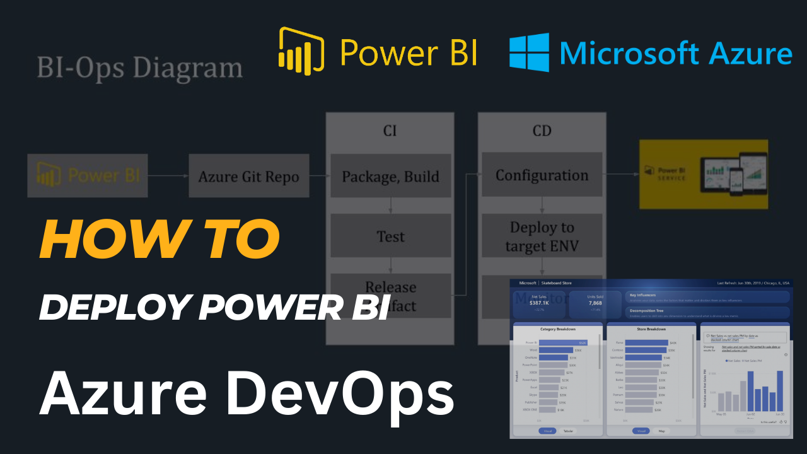
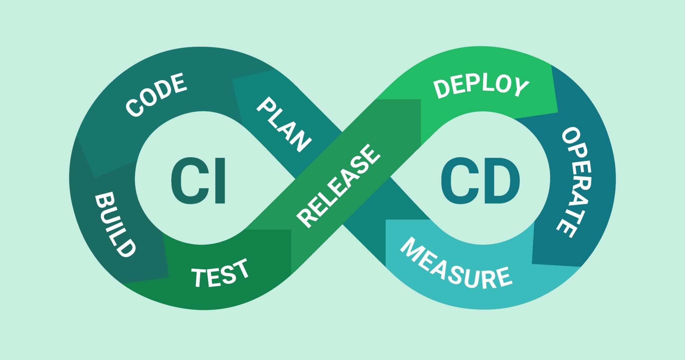
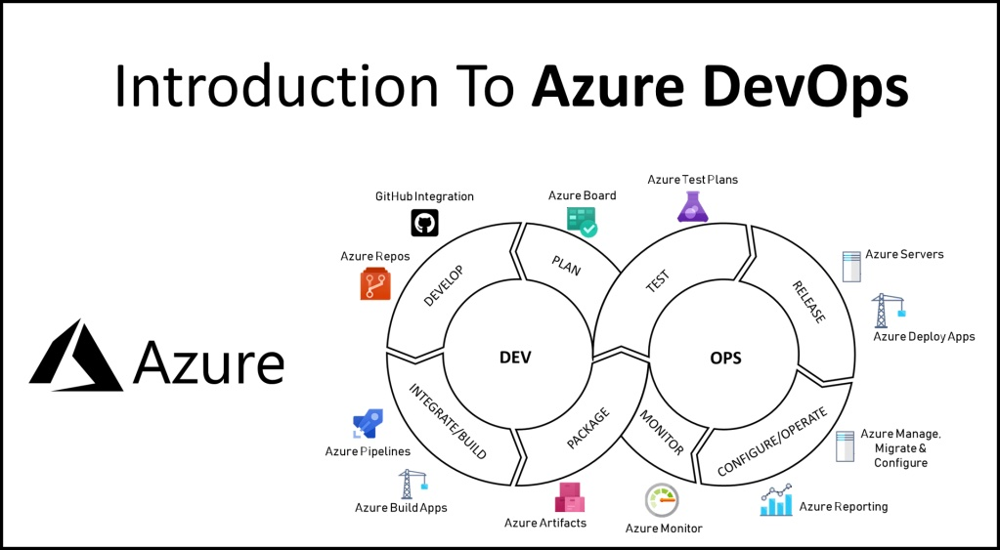
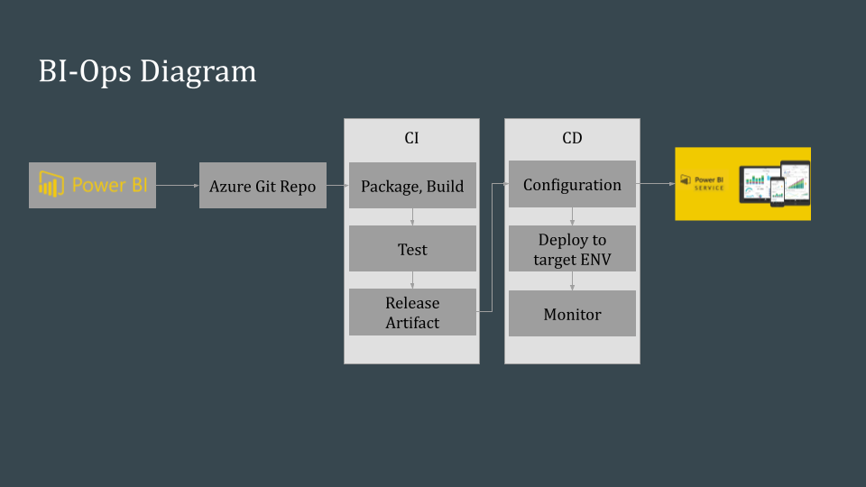
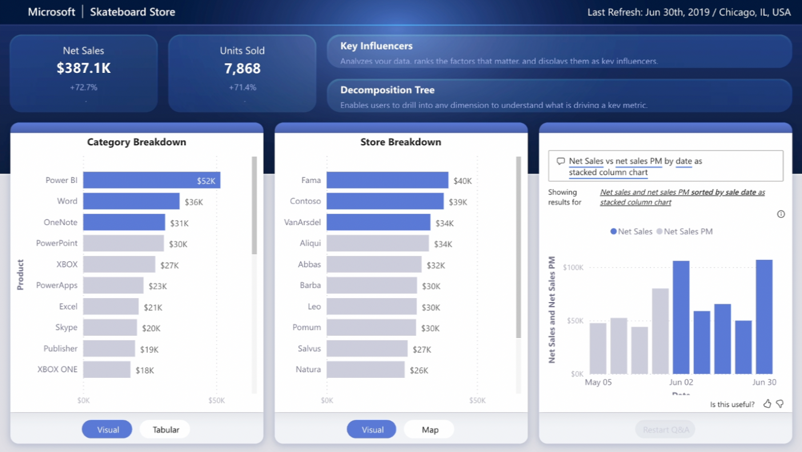



## Introduction of CICD

Automatic Deployment Process with CICD.

Watch YouTube video here: [https://youtu.be/LOtYqODiC8Q](https://youtu.be/LOtYqODiC8Q)

CICD is the process of planning, implementing, testing and deploying and repeating the process. Using Agile to implement CICD workflow is a great way to develop software.

1. Plan: Preparing Backlog and getting User Strory are ready for development
2. Code: Create/modify the source code
3. Build: Build or compile the source code
4. Test: running Unit Tests and other tests
5. Release: Send out code packages to target platforms (Artifactory)
6. Deploy: Running the deployment using kind of IaC
7. Operate: execute and ran operations
8. Measure: Monitor and log progress to enhancements

## From DevOps to BI-Ops

In order to implement CICD workflow, using Azure DevOps with combination of tool sets in below example:

*Notes*: The tool sets are different by platform and provider but the process is the same.

## How to deploy Power BI using Azure DevOps

You might know the DevOps that we deploy software application via code package, container, images, ... but how to deploy a file, this is the process to deploy Power BI using CICD.

You can deploy using `Publish` feature of Power BI, but it is not recommended because a lot of struggle you would have to resolved if manually trigger workspace publication. And it is not **AUTOMATION** will do.

Check out the video for getting an example.


